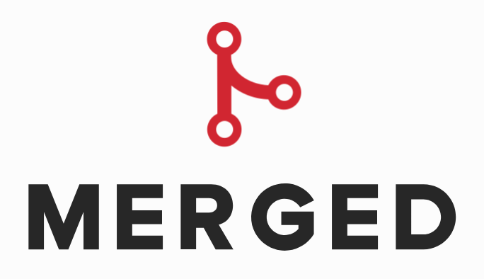

Merged is a community project that aims to provide a platform where students can easily view all activity and events from all Carleton tech student groups.

 

## Client

The main user interface, built with Next.js for SSR and good SEO.

## API

Written with Django REST Framework.
